# Django Library Management System

## Overview
This app allows librarians to manage books, members, and transactions within the local library. The functionalities include CRUD operations for books and members, issuing and returning books, and calculating rental fees. The application ensures that a member’s outstanding debt does not exceed KES 500.

## Features
- **Books Management**: Add, update, delete, and list books with stock information.
- **Authors Management**: Add, update, delete, and list authors.
- **Transactions**: Issue and return books to/from members. Show list of borrowed items per person and for everybody
- **Search**: Search for books by name and author.
- **Members Management**: Add, update, delete, and list library members with their full info
- **Rental Fees**: Charge rental fees on book returns.
- **Debt Management**: Ensure a member’s outstanding debt is not more than KES 500.
- **Security**: Librarian have to login to access the system

## Screenshots
### Homepage
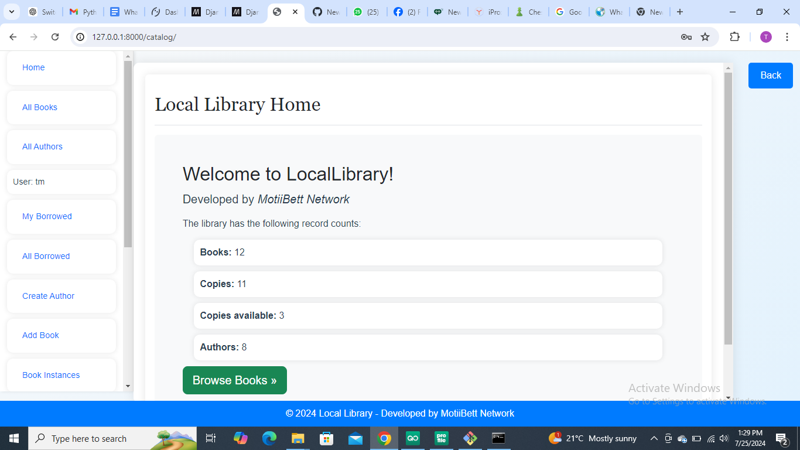
### Login
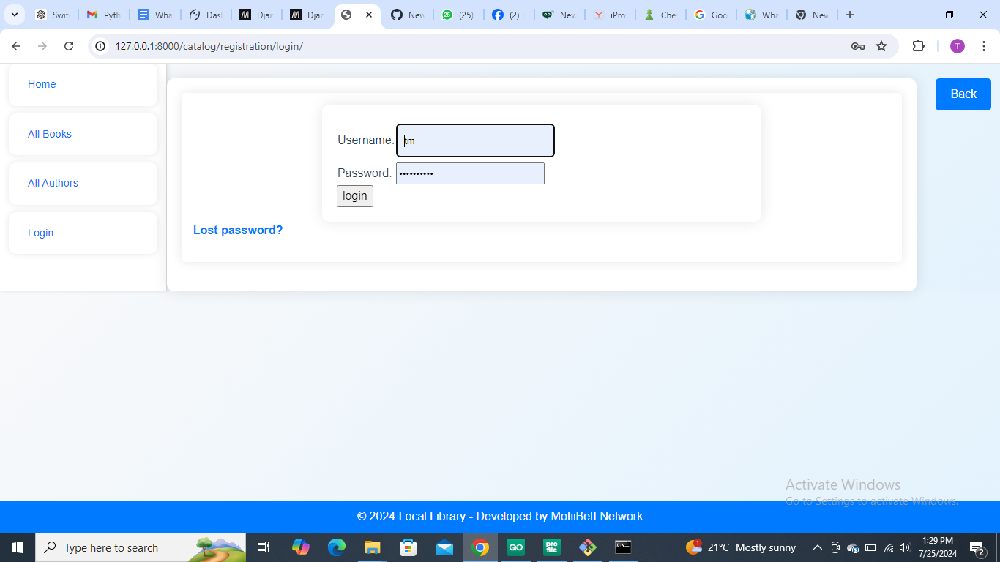
### Add Book

### Add Author
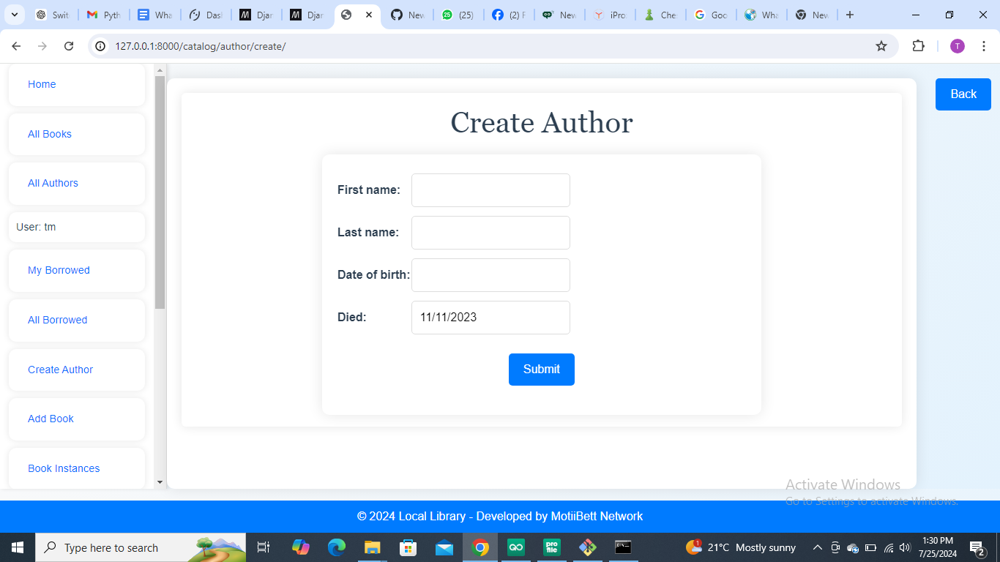
### Add Member
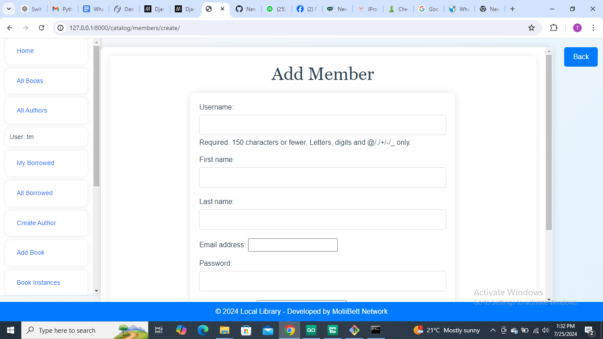
### Book List
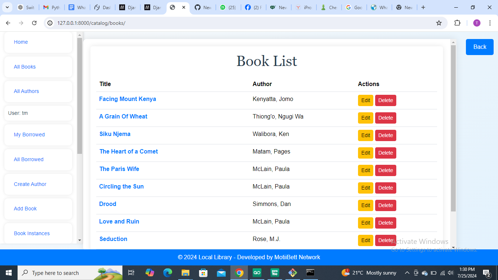
### Book Instances
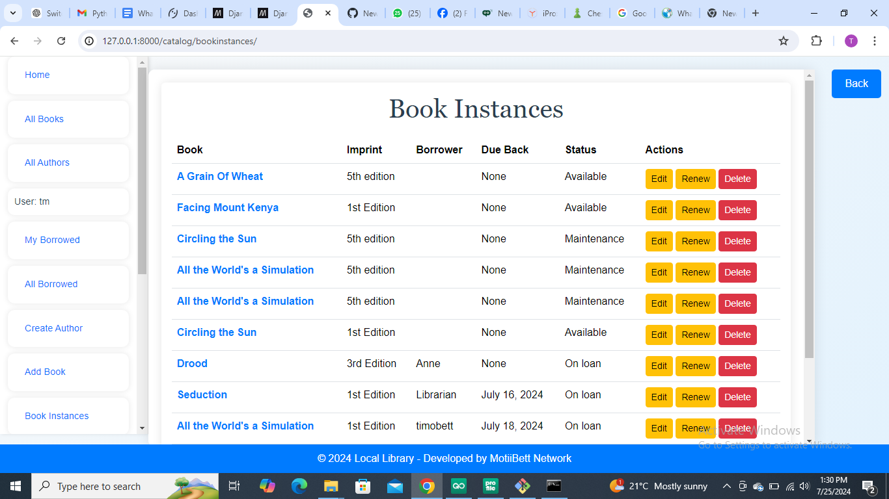
### All Borrowed Books
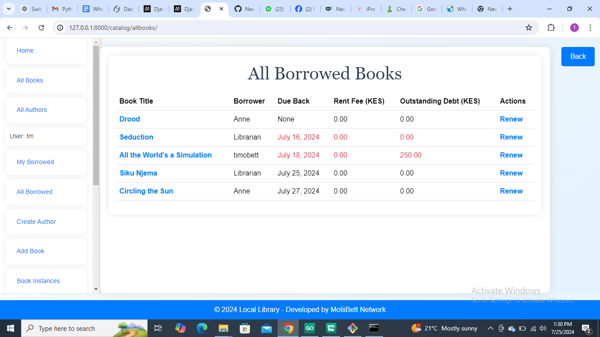
### Author List
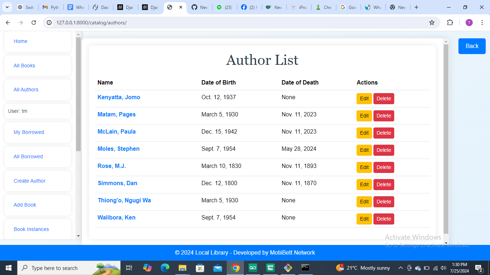
### Member List
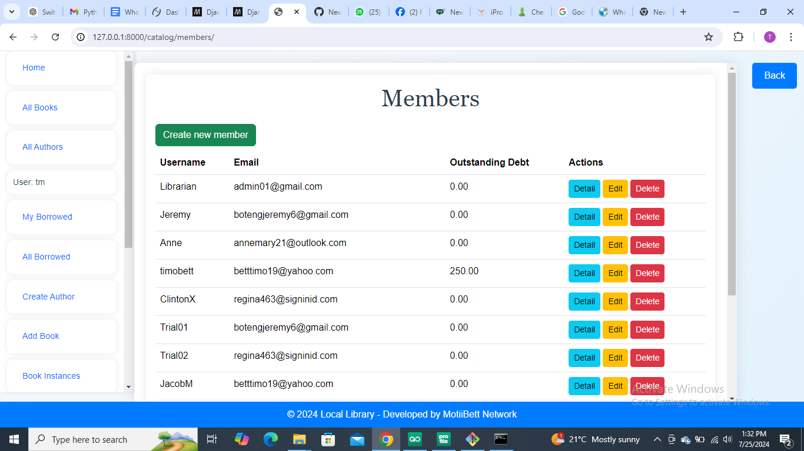
### Issue Book
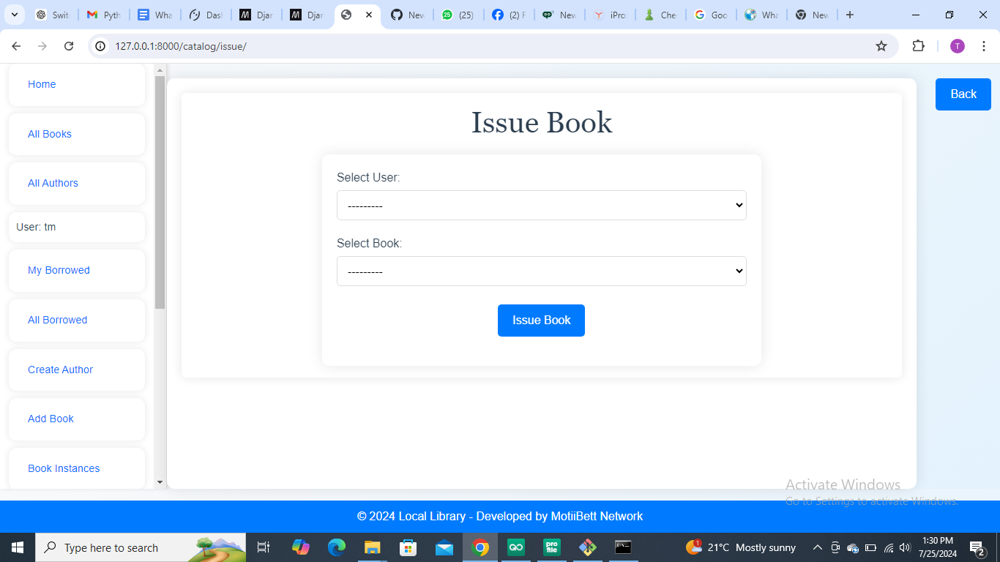
### Return Book
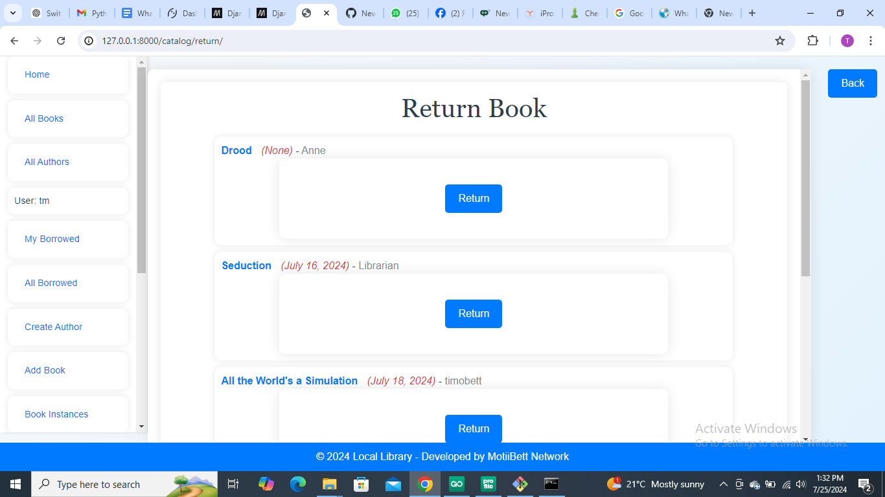
### Search Books
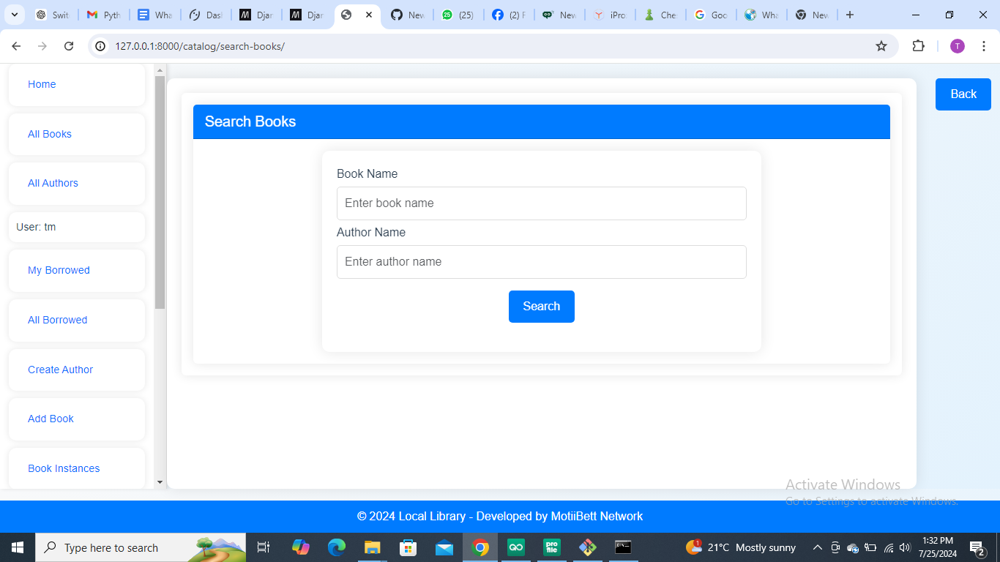
### Logout
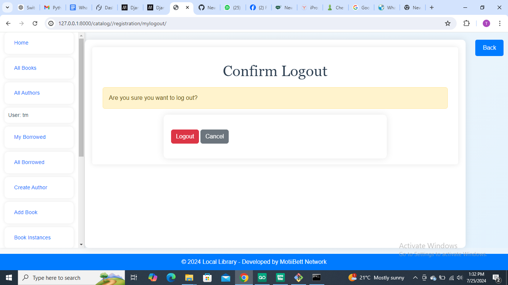

## Installation

1. **Clone the repository**
   ```sh
   git clone https://github.com/betttimo/Local-library.git
   cd your-repository-name
